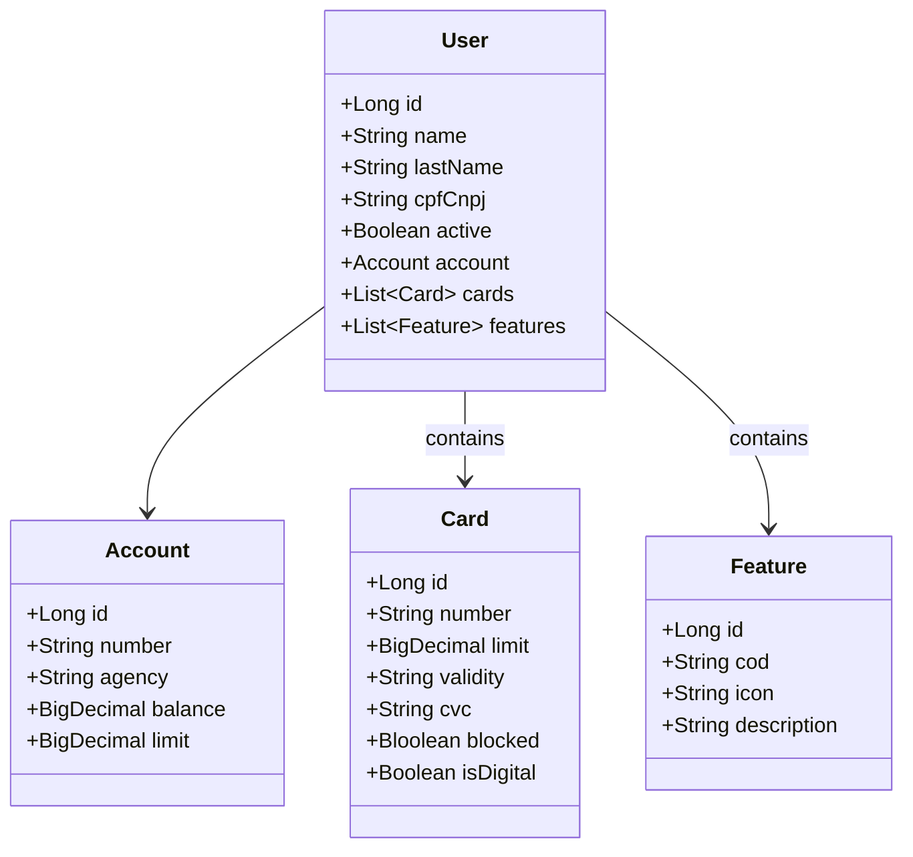

# Bank-api - Java 17, Spring Boot e Railway 🚀

## 📄 Descrição do Projeto
Este projeto de banco foi desenvolvido como parte do desafio de projeto do bootcamp da DIO.me em parceria com a Cognizant. Utilizando tecnologias modernas, como Java 17, Spring Boot e Railway, o objetivo principal deste projeto é criar uma aplicação bancária simples, escalável e fácil de manter, atendendo aos requisitos do desafio proposto.

## 🛠️ Tecnologias Utilizadas
- **Java 17:** Linguagem de programação moderna que oferece melhorias de desempenho, segurança aprimorada e novos recursos para um desenvolvimento mais eficiente.
- **Spring Boot:** Framework que simplifica a criação de aplicações standalone e de produção robustas, utilizando o poderoso ecossistema Spring.
- **Railway:** Plataforma de deployment que facilita a implementação e o gerenciamento de aplicações na nuvem, proporcionando alta disponibilidade e escalabilidade.
- **Maven:** Ferramenta de automação de build e gerenciamento de dependências, garantindo a consistência e a eficiência no processo de desenvolvimento.
- **Lombok:** Biblioteca que reduz o boilerplate no código Java, proporcionando maior produtividade e legibilidade ao eliminar a necessidade de escrever métodos repetitivos.
- **H2 Database:** Banco de dados relacional leve e rápido, ideal para ambientes de desenvolvimento e testes, oferecendo integração perfeita com o Spring Boot.

## 📊 Diagrama de Classes

## 🔍 Funcionalidade do Projeto 
- **Criação de Usuario, Contas e Cartões:** Sistema para criação e gerenciamento de contas bancárias, permitindo aos usuários abrir novas contas e visualizar suas informações.
- 

## ⚙️ Implementação 
A aplicação foi desenvolvida seguindo boas práticas de desenvolvimento, incluindo testes unitários e de integração para garantir a qualidade do código. O uso do Spring Boot facilitou a criação de uma API RESTful, enquanto a plataforma Railway simplificou o processo de deployment e gerenciamento da aplicação na nuvem.

---

Agradeço imensamente a oportunidade de participar deste bootcamp, que apresentou desafios valiosos e me permitiu aprimorar significativamente minhas habilidades como desenvolvedor backend.

---

## 🧑‍💻 Contribuições
Contribuições são bem-vindas! Sinta-se à vontade para abrir issues ou enviar pull requests.

Desenvolvido com ❤️ por [Marcos Correa](https://github.com/correamarcos) .

